# Influenza Outbreak Prediction — CRISP-DM


> Forecasting influenza outbreaks in North America using Linear Regression, Decision Tree, and Neural Network models under the CRISP-DM framework.

---

## Overview

Influenza poses a recurring public health challenge with significant hospitalization rates, economic burden, and mortality risk. This project applies the **CRoss Industry Standard Process for Data Mining (CRISP-DM)** to build predictive models for early detection and forecasting of influenza outbreaks using 28 years of surveillance data (1997–2025) from the WHO Global Influenza Surveillance and Response System (GISRS).

The work spans all five active phases of CRISP-DM — **Business Understanding, Data Understanding, Data Preparation, Modeling, and Evaluation** — and compares three regression approaches across two feature sets to determine the most effective strategy for operational deployment.

---

## Dataset

- **Source**: [WHO GISRS / FluNet](https://app.powerbi.com/view?r=eyJrIjoiNjViM2Y4NjktMjJmMC00Y2NjLWFmOWQtODQ0NjZkNWM1YzNmIiwidCI6ImY2MTBjMGI3LWJkMjQtNGIzOS04MTBiLTNkYzI4MGFmYjU5MCIsImMiOjh9) — weekly influenza surveillance data
- **Geography**: United States (USA) and Canada
- **Time Range**: December 1997 – February 2025
- **Size**: ~10,000 records (post-cleaning) with 16 engineered attributes
- **Target Variable**: `Total_Influenza_Cases` (aggregate confirmed cases)

### Key Features Used

| Category | Features |
|---|---|
| Temporal | `ISO_YEAR`, `ISO_WEEK`, `Month`, `Season_numeric` |
| Lag Indicators | `INF_ALL_LAG_1`, `INF_ALL_LAG_2`, `INF_ALL_LAG_4` |
| Viral Strains | `INF_A`, `INF_B` |
| Activity Proxy | `ILI_ACTIVITY` (Influenza-Like Illness activity level) |
| Lab Volume | `SPEC_PROCESSED_NB` |

<p align="center">
  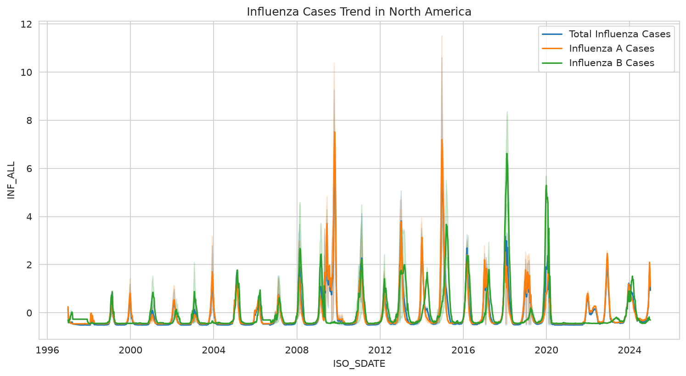
</p>
<p align="center">
  <em>Weekly influenza cases over the full 28-year window. Seasonal periodicity is clearly visible, with winter peaks and notable outbreaks in 2009 (H1N1 pandemic), 2014, and 2017.</em>
</p>

---

## Pipeline

```
Raw GISRS Data → EDA → Cleaning → Feature Engineering → Smoothing → Modeling → Evaluation
```

1. **Exploratory Data Analysis** — Seasonal decomposition, correlation analysis, missing value profiling
2. **Data Cleaning** — Forward-fill for short gaps, IQR-based outlier detection (outliers retained as real-world events)
3. **Feature Engineering** — Lag features (1, 2, 4 weeks), wavelet denoising, moving average/EWA smoothing, date-based temporal features, percentage change transformation
4. **Data Splitting** — Chronological: Train (1997–2019), Validation (2020–2022), Test (2023–2024)

### Seasonal Decomposition

<p align="center">
  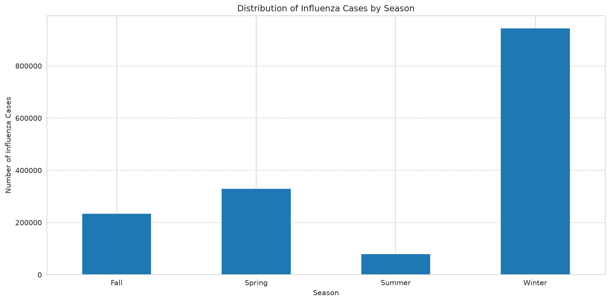
  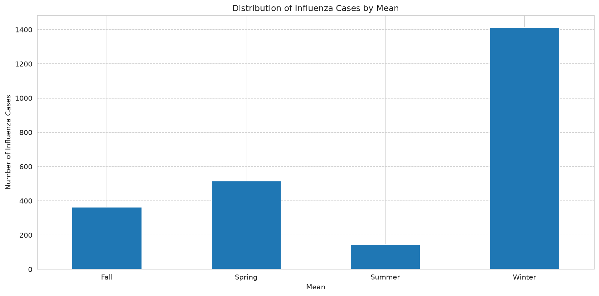
  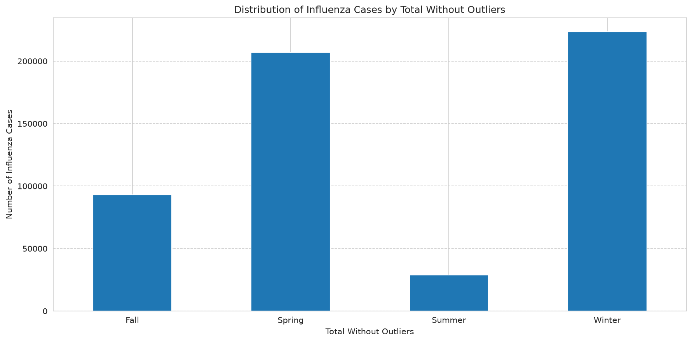
</p>
<p align="center">
  <em>Left to right: Total seasonal case counts, mean seasonal counts, and counts with outliers removed. Winter consistently dominates.</em>
</p>

### Smoothing Techniques

Three smoothing approaches were evaluated. Discrete Wavelet Transformation (DWT) preserved the best signal-to-noise ratio while capturing inflection points.

<p align="center">
  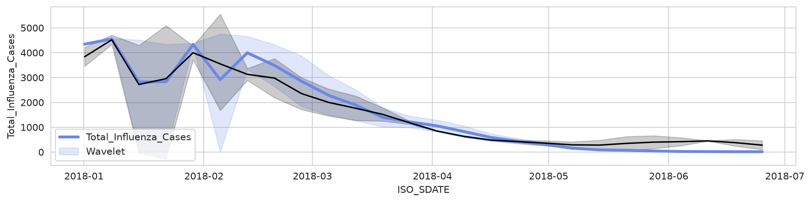
  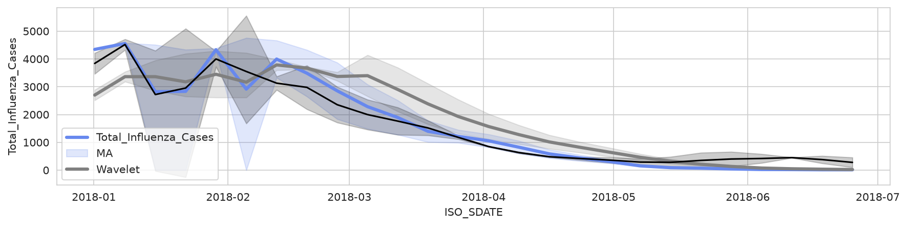
  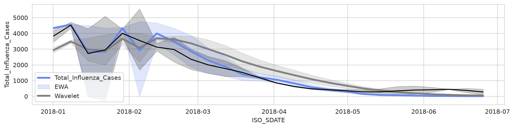
</p>
<p align="center">
  <em>DWT (left) captures trend inflection points best; MA (center) shows lag; EWA (right) balances responsiveness and variability.</em>
</p>

### Correlation Structure

<p align="center">
  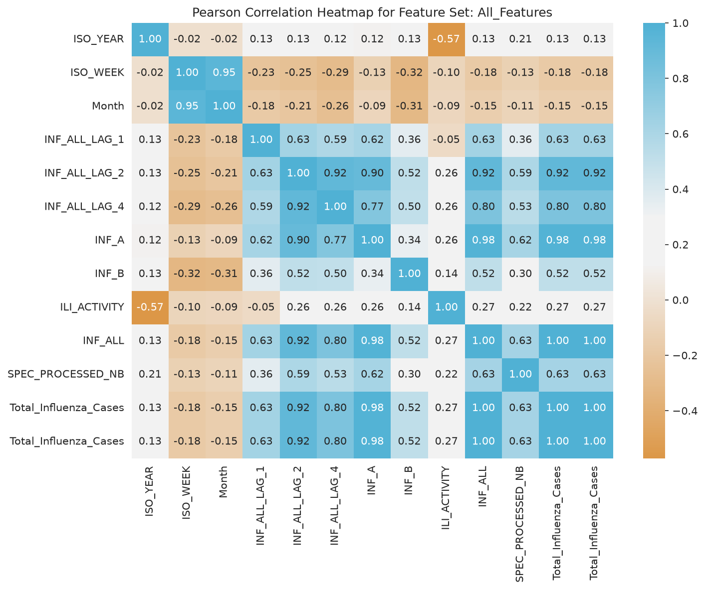
  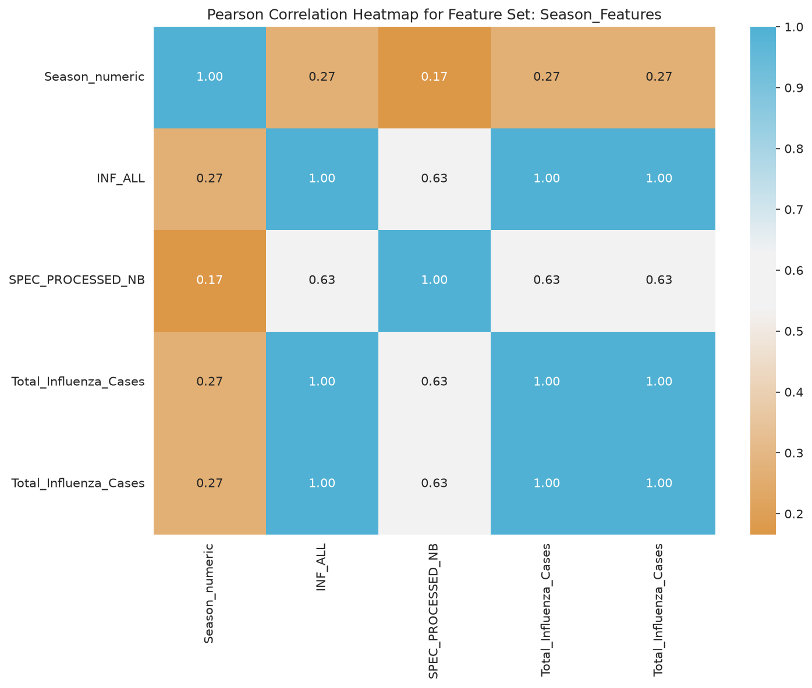
</p>
<p align="center">
  <em>Strong correlation between INF_ALL and INF_A/INF_B confirms these strains dominate case counts. ILI_ACTIVITY shows moderate correlation with reported cases.</em>
</p>

---

## Models

Three models were trained on **two feature sets** (All Features and Seasonal Features) and evaluated on the validation set using **Mean Absolute Error (MAE)** and **Mean Squared Error (MSE)**:

### Linear Regression (LR)
- Scikit-learn baseline with default parameters
- Serves as benchmark for linear trend estimation

### Decision Tree Regressor (DT)
- Non-parametric, captures non-linear patterns
- Default scikit-learn configuration (post-pruning deferred)

### Neural Network Regressor (NN / MLP)
- Keras 3-layer MLP: 64 → 32 → 16 units, ELU activations
- Batch normalization + dropout (0.2) per layer for regularization
- RMSprop optimizer (lr=0.001), EarlyStopping (patience=10)

All non-linear models were trained on **percentage change** of the target variable to stabilize variance.

---

## Results

> Full metrics: [`KPM/model_performance_metrics.csv`](./KPM/model_performance_metrics.csv)

| Feature Set | Model | MAE | MSE |
|---|---|---|---|
| **All Features** | **Neural Network (NN)** | **0.387** | **1.687** |
| All Features | Decision Tree (DT) | 0.318 | 1.046 |
| All Features | Linear Regression (LR) | ~0.000 | ~0.000 |
| Seasonal Features | Neural Network (NN) | **0.623** | **2.039** |
| Seasonal Features | Decision Tree (DT) | 11.906 | 8,705.619 |
| Seasonal Features | Linear Regression (LR) | ~0.000 | ~0.000 |

<p align="center">
  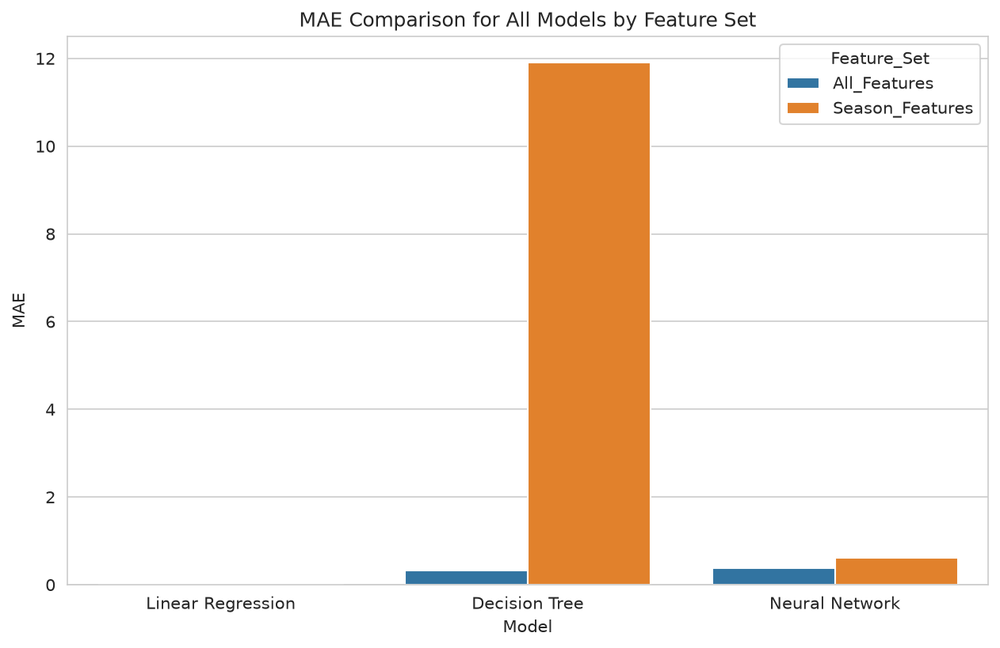
  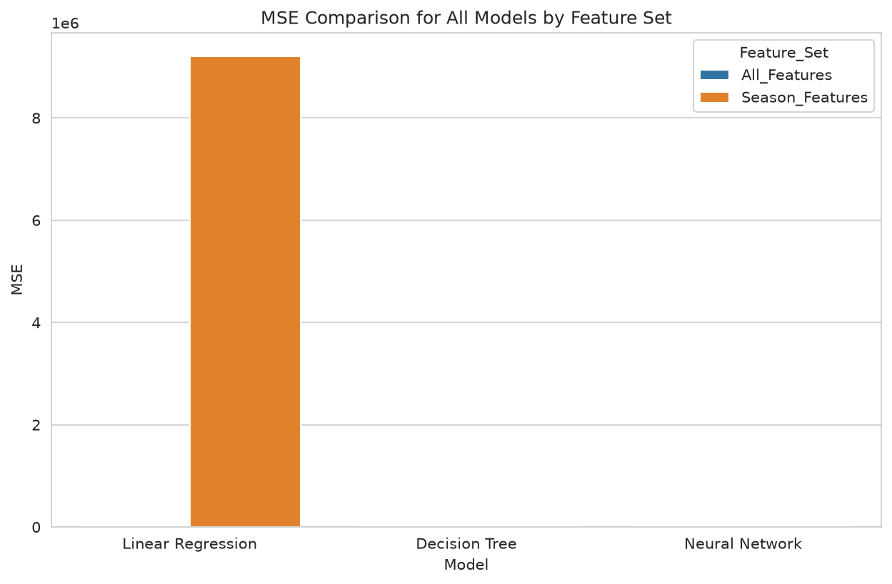
</p>

### Predicted vs. Actual

<p align="center">
  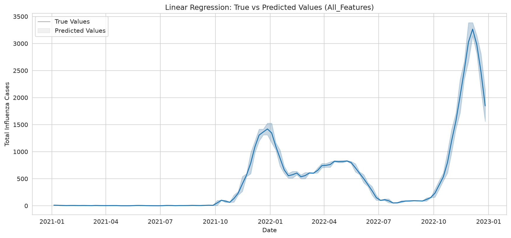
  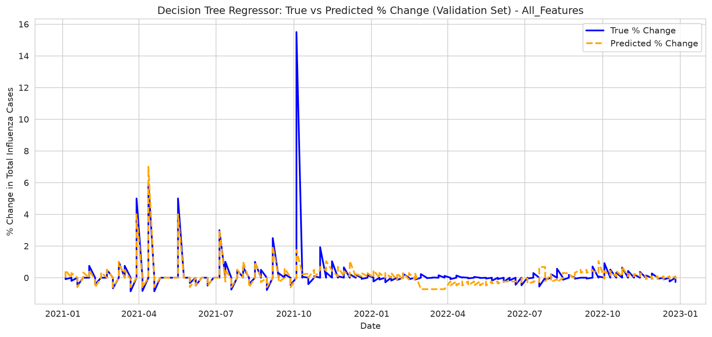
  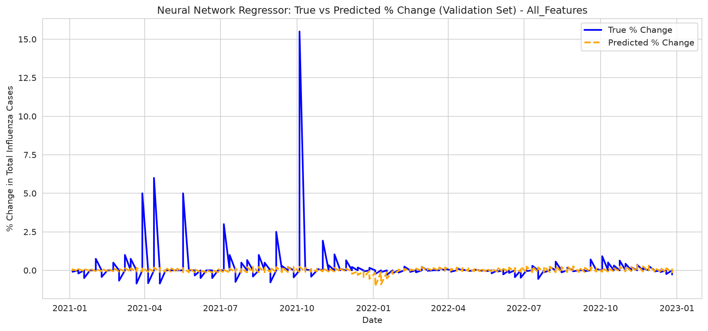
</p>
<p align="center">
  <em>All Features: LR (left), DT (center), NN (right). The Neural Network tracks the validation trend most closely.</em>
</p>

<p align="center">
  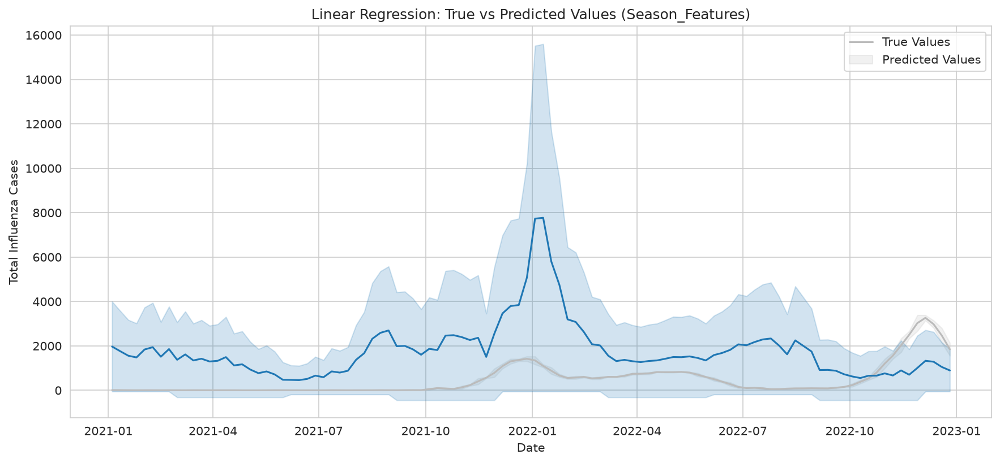
  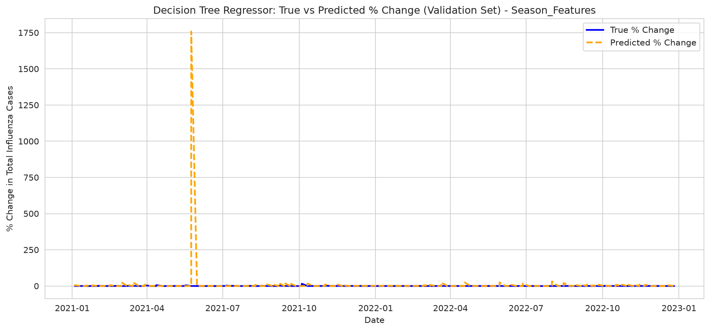
  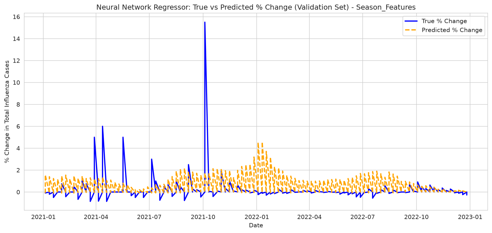
</p>
<p align="center">
  <em>Season Features: LR (left) fails entirely with limited context; DT (center) struggles; NN (right) maintains reasonable accuracy.</em>
</p>

---

## Key Findings

- **Neural Network Regressor** achieved the lowest error across both feature sets on percentage change data, confirming that non-linear, deep architectures are best suited for the complex, cyclical dynamics of influenza outbreak data.
- **Decision Tree** performed competitively on the full feature set (MAE: 0.32) but degraded significantly with seasonal-only features (MAE: 11.91), highlighting its dependency on rich, granular inputs.
- **Linear Regression** achieved near-zero error due to the inclusion of `Total_Influenza_Cases` (identical to the target `INF_ALL`) as a feature, illustrating the importance of feature selection in avoiding data leakage.
- **The rich feature set (All Features) consistently outperformed the reduced seasonal set**, validating the inclusion of lag variables, strain counts, and ILI activity indicators.
- **Winter consistently emerged as the peak influenza season** across all analyses, aligning with established epidemiological patterns.
- **Wavelet denoising** outperformed both moving average and EWA smoothing, preserving critical inflection points while reducing noise.

### Phase 5 Evaluation Conclusion

All defined business objectives were met: prediction accuracy, timely trend detection through temporal/seasonal features, and actionable insights via interpretable model outputs. The recommended operational strategy pairs the **Neural Network** (for accuracy) with the **Decision Tree** (for interpretability), providing the best balance for public health decision-making.

---

## Tech Stack

| Category | Libraries |
|---|---|
| Data manipulation | `pandas`, `numpy` |
| Classical ML | `scikit-learn` |
| Deep Learning | `tensorflow` / `keras` |
| Signal Processing | `PyWavelets` (DWT) |
| Visualization | `matplotlib`, `seaborn` |

---

## Project Structure

```
├── influenza_outbreak_prediction_updated_code.py   # Full analysis & model pipeline
├── DataExport_AMR_NA_020425.xlsx                   # Raw GISRS dataset
├── CS633_Influenza_Outbreak_Prediction_Final_CRISP-DM.docx  # Original CRISP-DM report (DOCX)
├── Report/
│   └── Assignment/flu/
│       └── charts/                                 # 22 generated visualizations
├── KPM/
│   └── model_performance_metrics.csv               # Model evaluation metrics
├── requirements.txt                                # Python dependencies
├── .devcontainer/
│   └── devcontainer.json                           # Codespaces config
├── .gitignore
└── README.md
```

---

## Setup

### Python

```bash
pip install -r requirements.txt
```

Run the full pipeline:

```bash
python influenza_outbreak_prediction_updated_code.py
```

This generates all 22 charts and the model performance metrics.

---
